Relatório Final - COVID-19 em Minas Gerais
================
Grupo 1: Bárbara Oliveira, Kamilla Jotadiemel e Keylla Martins
05/08/2020

O presente relatório é a entrega do Trabalho Final da disciplina
optativa <i>Análise e Visualização de Dados com R</i>.

Na realização deste trabalho, optamos por explorar um tema já explorado
nas aulas, a pandemia do COVID-19. Buscamos explorar os dados fornecidos
pelo Estado para identificar se há alguma correlação entre a ocorrência
de casos e óbitos por COVID-19 no Estado e fatores de desigualdade
social.

Para fins de análise dos dados, foram formuladas as seguintes perguntas,
que seráo respondidas ao longo do relatório:

<i><u>Recorte regional:</i></u>

Qual a quantidade de contaminados em cada macrorregião?

Qual a quantidade de óbitos em cada macrorregião?

Qual a taxa de letalidade em cada macrorregião?

<i><u>Recorte de gênero:</i></u>

Qual a quantidade de contaminados por gênero?

Qual a quantidade de óbitos por gênero?

Qual a taxa de letalidade por gênero?

<i><u>Recorte de raça:</i></u>

Qual a quantidade de contaminados por raça?

Qual a quantidade de óbitos por raça?

Qual a taxa de letalidade por raça?

<i><u>Análise dos dados:</i></u>

Qual a diferença na proporção entre a contaminação e os óbitos entre as
macrorregiões?

Qual a diferença na proporção entre a contaminação e os óbitos entre os
gêneros?

Qual a diferença na proporção entre a contaminação e os óbitos entre as
raças?

<b> Descrição da base de dados</b>

A base de dados escolhida foi retirada do Painel de Monitoramento de
Casos da COVID-19 da Secretaria de Estado de Saúde de Minas Gerais
(SES-MG), no dia 19 de julho de 2020. O Painel é atualizado diariamente
com registros provenientes das Secretarias Municipais de Saúde (SMS) do
estado, sobre a evolução da doença, contabilizando novos casos, óbitos e
recuperações, além de informações sobre o perfil dos pacientes (idade,
raça, sexo, comorbidade, município, etc.). Está composto, até o momento,
por três arquivos com diferentes metodologias de contagem:

1.  CSV Painel: compilado das informações encaminhadas pelos municípios
    para a SES-MG para a elaboração do Boletim Epidemiológico, composto
    apenas com as informações de casos confirmados por dia, segundo
    município de residência.

2.  CSV Sistemas: formado pelo agrupamento das informações dos Sistemas
    de Informação em Saúde oficiais, E-SUS VE (para casos leves de
    COVID-19) e SIVEP-GRIPE para casos graves e óbitos, além dos casos
    que realizaram exames em laboratórios particulares, públicos e
    farmácias (testes rápidos).

3.  CSV Laboratórios: resultados de exames para a COVID-19 realizados em
    laboratórios particulares, públicos e farmácias (testes rápidos).

Para realização do trabalho foram selecionados os dados do CSV Sistemas.
A partir disso, optou-se por direcionar a análise da distribuição e
evolução dos casos em três focos: entre as macrorregiões de saúde, entre
sexos e entre raças. As 13 macrorregiões estão definidas no Plano
Diretor de Regionalização (PDR) da SES e foram construídas com base no
fluxo da população em busca de atendimento à saúde. São considerados os
sexos feminino e masculino (sexo biológico), seguindo a metodologia dos
sistemas de informações oficiais. A raça dos pacientes é classificada de
acordo com as cinco categorias utilizadas pelo Instituto Brasileiro de
Geografia e Estatística (IBGE): Branco (branco), Preto (preto), Amarelo
(leste asiático), Indígeno (indígena) ou Pardo (etnia mista). A seguir
serão apresentados os resultados de cada recorte.

<b> Recorte por Macrorregiões</b>

O primeiro recorte foi feito com base nas 14 macrorregiões de Minas
Gerais. Optou-se por manter os dados “Não Informados” para fazermos uma
mensuração da relevância quantitativa destes casos.

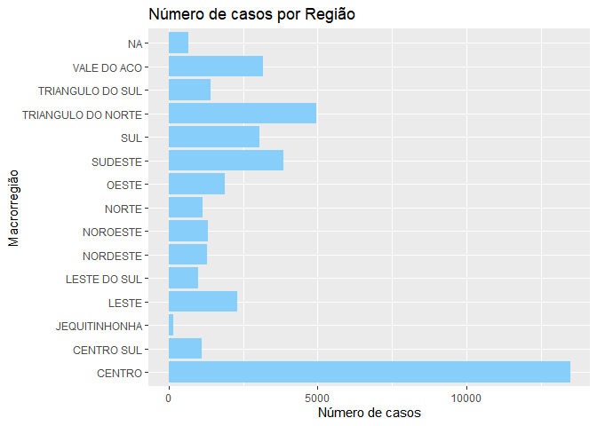<!-- -->

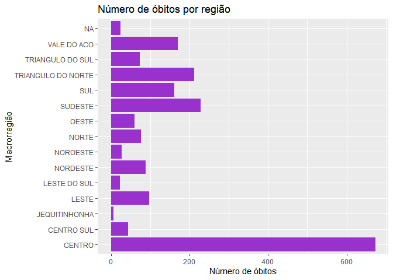<!-- -->

Os dois gráficos acima apresentam uma grande ocorrência - e
consequentemente óbitos - na região Central do Estado. Entretanto,
pode-se associar a discrepância das ocorrências à subnotificação dos
casos no interior do Estado, principalmente nas regiões mais pobres, uma
vez que o Estado possui grandes diferenças socioeconômicas entre suas
macrorregiões. Nesse sentido, não é possível observar nesses gráficos
nenhuma correlação entre fatores socioeconômicos e o contágio e/ou óbito
por COVID-19.

Deste modo, partimos para a comparação da taxa de letalidade entre as
macrorregiões.

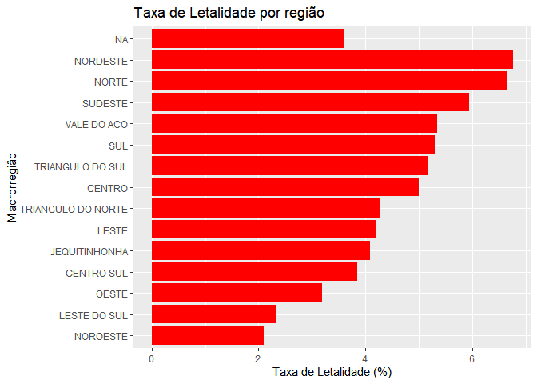<!-- -->

A taxa de letalidade por macrorregiões mostra que, de fato, há uma
diferença considerável entre a relação entre doentes e mortos em cada
região. Entretanto, em atividades anteriores da disciplina, foi
constatado que existe uma grande relação entre a taxa de óbitos e a
faixa etária dos casos confirmádos. Então, antes de avaliar se de fato
haveria um fator socioeconômico associado à taxa de letalidade, foram
elaborados gráficos a fim de analisarmos se existia uma diferença
relevante na faixa etária dos contaminados das 3 regiões que
apresentaram maior e menor taxa de letalidade.

<u>Faixa etária dos casos nas regiões com maior taxa de letalidade:
Nordeste, Norte e Sudeste</u>

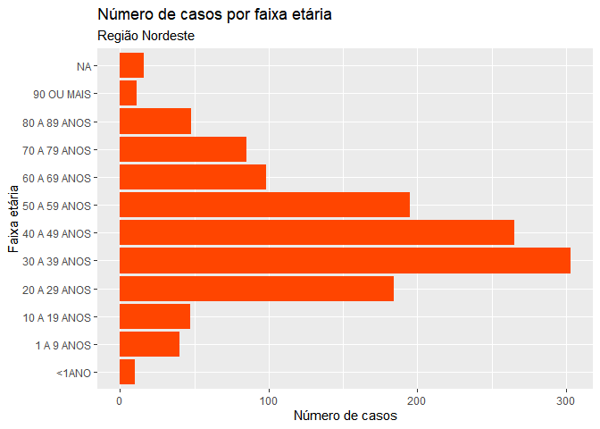<!-- --><!-- -->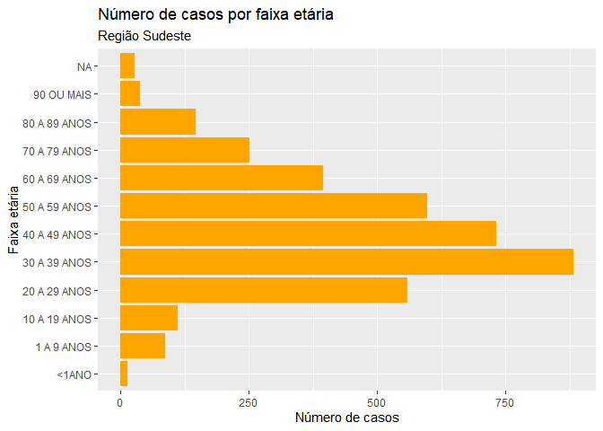<!-- -->

<u>Faixa etária dos casos nas regiões com menor taxa de letalidade:
Oeste, Leste do Sul e Noroeste</u>

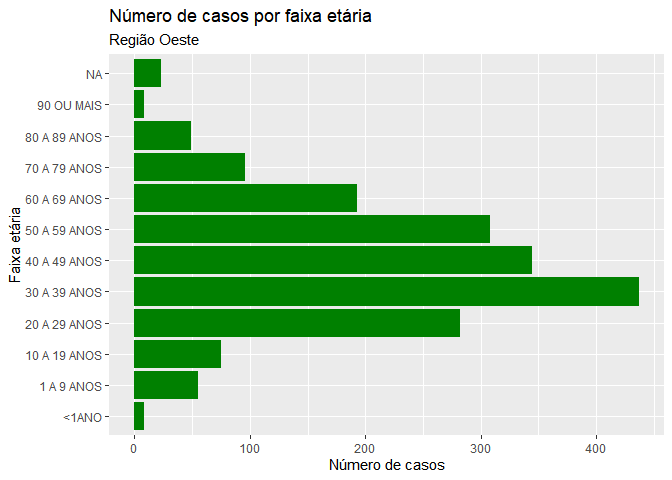<!-- -->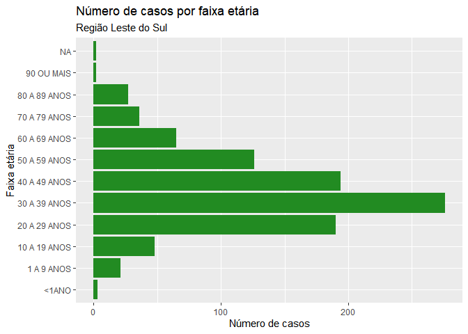<!-- -->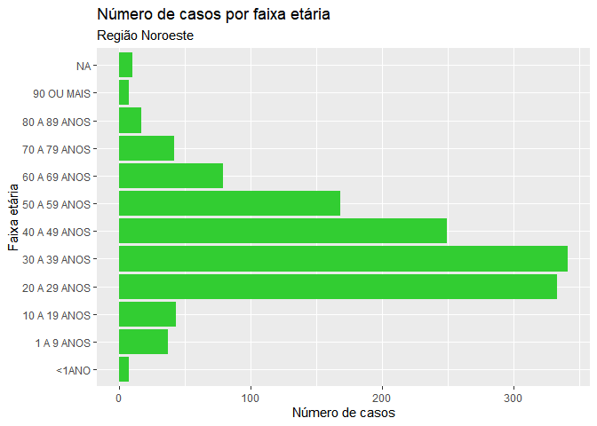<!-- -->

Nos gráficos acima, é possível perceber que, nas regiões de maior taxa
de letalidade, há um discreto aumento de casos em faixas etárias mais
altas (de 40 a 59 anos), mas não houve muito aumento entre as faixas
etárias acima de 60 anos, que são as faixas etáridas da zona de risco
da doença. Do mesmo modo, foi possível observar ligeiro aumento de casos
na faixa etária de 20 a 29 anos na região noroeste, a região com menor
taxa de letalidade. Entretanto, isso não é observado nas outras duas
regiões de menor taxa de letalidade. Além disso, em todas as 6 regiões
analisadas nesse quesito, todas elas apresentam a maioria dos casos na
mesma faixa etária, entre 30 e 39 anos, de modo que a questão da faixa
etária não é suficiente para explicar as diferenças nas taxas de
letalidade entre as regiões.

Entretanto, ao observarmos nas imagens abaixo o mapa de Minas Gerais por
regiões e por IDH dos municípios cada região, é possível observar uma
concentração maior de muncípios de IDH mais baixo nas regiões com taxa
de letalidade mais alta, bem como uma concentração maior de municípios
de IDH mais alto nas regiões com taxa de letalidade mais baixa, o que
poderia indicar que as condições socioeconômicas das regiões teriam
alguma influência sobre a evolução a óbito da doença.

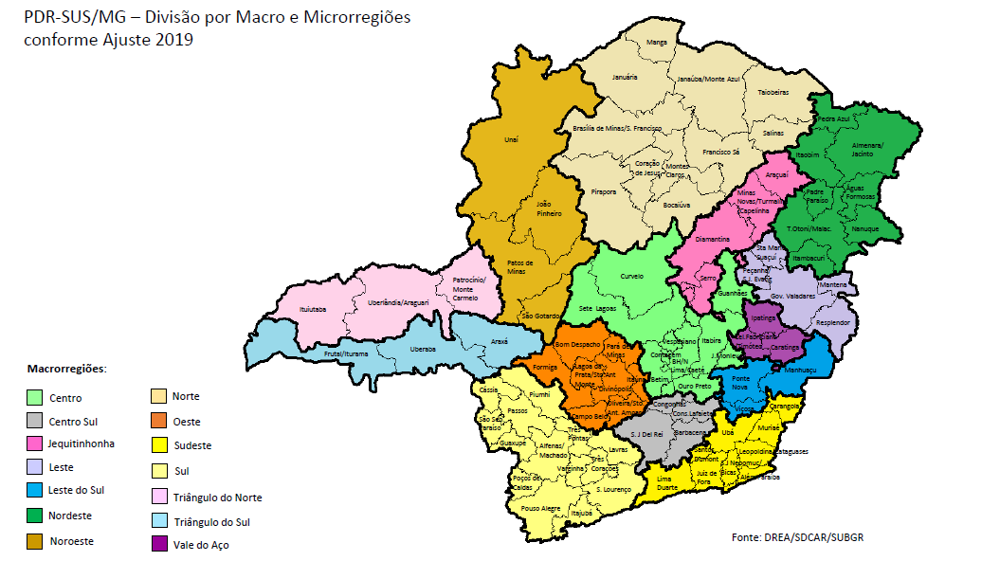

Obs.: Quanto mais escuro o tom de azul do mapa, maior o IDH da cidade; e
quanto mais claro, menor o IDH.

<b> Recorte por Gênero</b>

Em primeiro lugar, é importante ressaltar que a base de dados escolhida
apresenta a classificação apenas por sexo. Neste trabalho, considera-se
o termo “gênero” para fins didáticos, sem desconsiderar a pluralidade
que o termo representa. Visto isso, uma limitação de análise é a falta
de distinções de informações de gênero, o que dificulta, a exemplo,
identificar o quanto a parcela da população trans é afetada pela séria
pandemia de coronavírus.

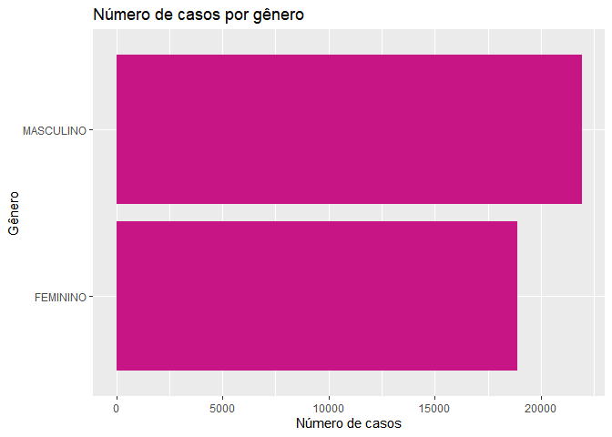<!-- -->

O gráfico indica que, pelo recorte de gênero, a parcela mais afetada por
casos de coronavírus são do gênero masculino, com 21923 casos,
notificados entre 01/04 e 31/05, configurando um percentual em torno de
16% maior que casos do gênero feminino (18891 casos)

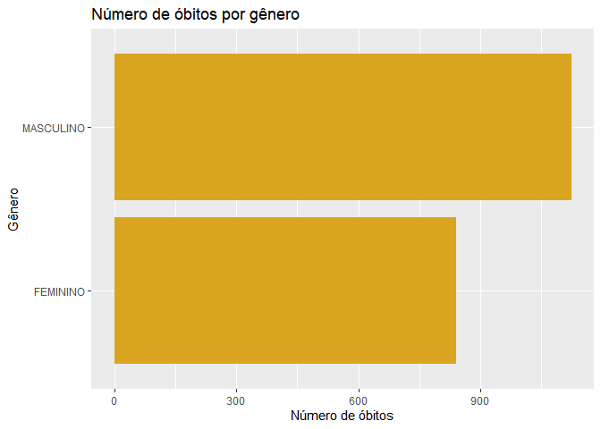<!-- -->

A maior parcela de vítimas de coronavírus é ainda do gênero masculino
(1123 óbitos) , e em relação proporcional às vítimas femininas(841
óbitos), é 33,53% maior. Ou seja, a diferença entre gênero feminino e
masculino é ainda mais expressiva no número de óbitos, o que confere uma
diferença de 17, 53% na proporção entre a contaminação e os óbitos entre
os gêneros.

Ademais, foi observado o recorte de gênero no número de óbitos entre as
faixas etárias, como se segue:

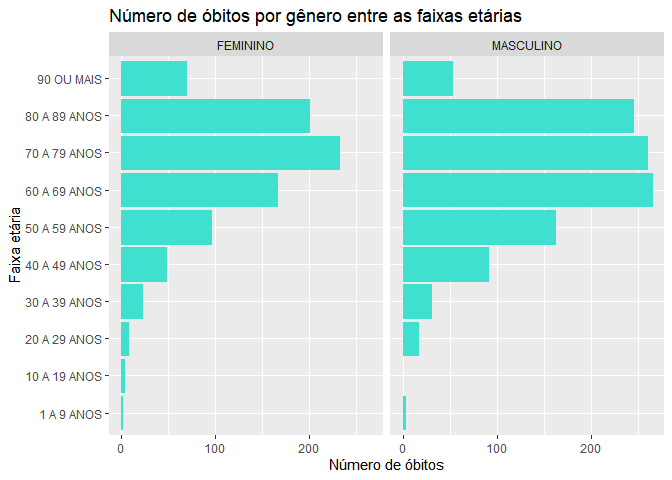<!-- -->

É possível identificar que a faixa mais afetada entre os gêneros está
entre 60 a 80 anos, e na faixa de 60 a 69 anos o número de óbitos é a
faixa em que o número de óbitos entre os gêneros mais se aproxima. É
importante ressaltar que a única faixa em que o número de óbitos é maior
no gênero feminino é a faixa de 10 a 19 anos, visto que, nesse contexto,
o gênero masculino não registrou nenhum óbito.

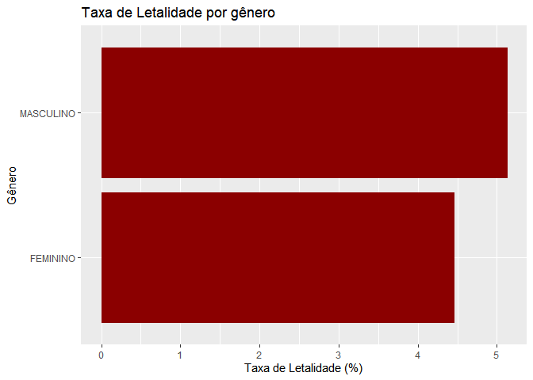<!-- -->

A taxa de letalidade é de 5,12% para o gênero masculino e de 4,45% para
o gênero feminino, dado já esperado pelo padrão apresentado acima. O
padrão de maior número de casos, óbitos e taxa de letalidade mais
expressiva pode se relacionar marcantemente à uma menor taxa de cuidados
contra o vírus nessa parcela, como menor uso de máscaras e de
distanciamento social, a considerar que inúmeros dados evidenciam um
padrão, já existente antes da pandemia, de que os homens cuidam menos da
sáude que as mulheres, a exemplo do levantamento do Ministério da Saúde,
que mostra que, somente em 2017, 80 milhões de mulheres se consultaram
com médicos a mais do que os homens no Brasil.

Por fim, foi realizado outro recorte importante na base de dados: taxa
de letalidade entre o gênero feminino por raças, como mostra o gráfico
abaixo. Em primeiro lugar, é necessário ressaltar que os casos/óbitos
com raças não informadas foram retirados da análise. Os resultados
práticos podem ser distintos, visto que 45 % dos casos não apresentam a
informação, como será melhor explorado no recorte de raça. Assim, esse
problema configura-se como outra limitação do banco de dados, visto que
os casos não informados são muito expressivos.

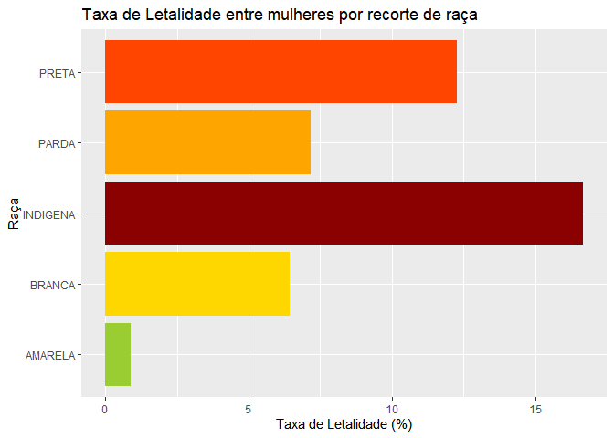<!-- -->

Em suma, o gráfico revela o triste retrato da realidade social
brasileira no contexto de coronavírus: a taxa de letalidade é a maior
entre as mulheres indígenas, com 16,67%, seguida por mulheres pretas,
com 12,28% e por mulheres pardas, com 7,17% de taxa de letalidade.

<b> Recorte por Raça</b>

Nessa análise, buscou-se avaliar a distribuição de casos confirmados
entre raças, bem como a relação de óbitos e a taxa de letalidade
existente nesse recorte. A princípio, foram selecionados todos os 40.815
casos confirmados (até 19/07/2020) em Minas Gerais, como demonstra o
gráfico abaixo:

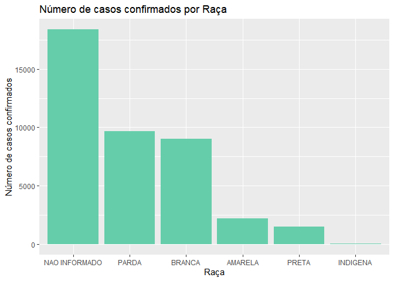<!-- -->

Observa-se que em 45,1% dos casos registrados não foram informadas as
raças das pessoas contaminadas (18.388), gerando um fator dificultador
da análise. Diante disso, foi necessário limpar os dados disponíveis e
selecionar apenas os pacientes com raça identificada para investigar a
distribuição da Covid-19. Assim feito, o gráfico abaixo foi obtido:

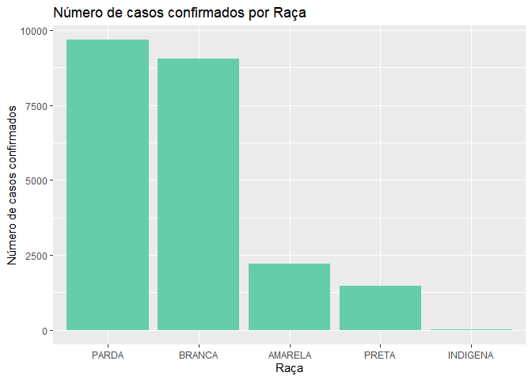<!-- -->

É possível notar a predominância de casos entre as raças parda (9.672) e
branca (9.044), evidência coerente com a composição étnica da população
de Minas Gerais. O Censo de 2010, último realizado, apontou que cerca de
45,4% dos mineiros se autodeclaram brancos, contra 53,5% autodeclarados
negros (44,3% pardos e 9,2% pretos). Há, no entanto, leve desvio quando
se observa a quantidade de casos em pessoas pardas, que supera em 6,9% a
de pessoas brancas. Amarelos, pretos e indígenas ocupam as últimas
posições, com 2.211, 1.482 e 18 casos confirmados, respectivamente.

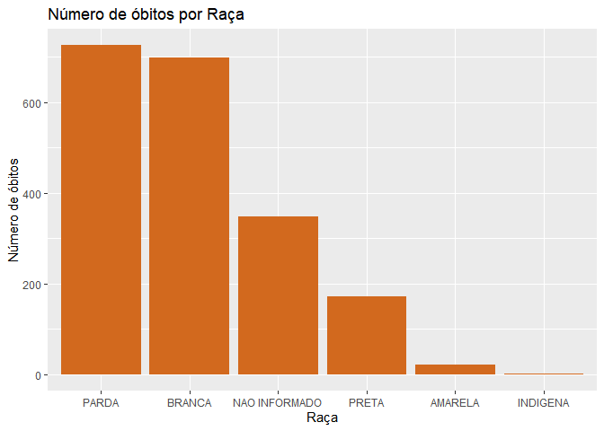<!-- -->

Em seguida, foram analisados os óbitos por raça, já desconsiderando os
casos não informados. Novamente, e conforme esperado, pardos (725) e
brancos (698) são também aqueles com maior quantidade de óbitos por
covid-19. Amarelos (21) e indígenas permanecem com baixos números, sendo
deste último apenas uma morte. Contudo, nota-se o deslocamento para a
terceira posição a quantidade de óbitos de pessoas pretas (172), antes
em quarto lugar no gráfico de casos confirmados já apresentado.

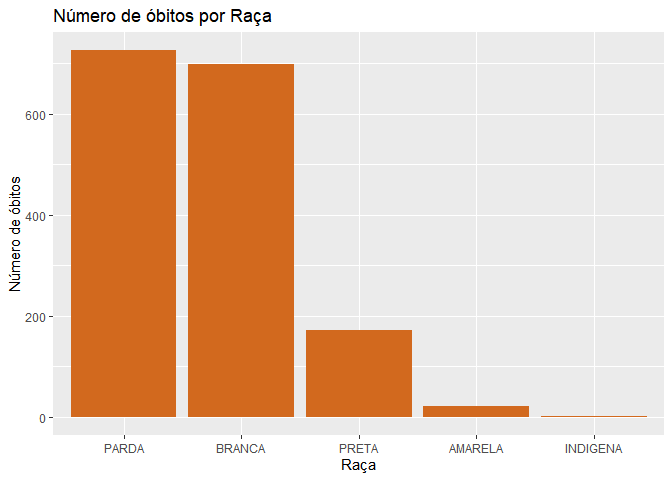<!-- -->

Essa variação sugere um indício na diferença da proporção entre a
contaminação e os óbitos entre raças. A fim de investigar essa hipótese,
foi calculada a taxa de letalidade por raça.

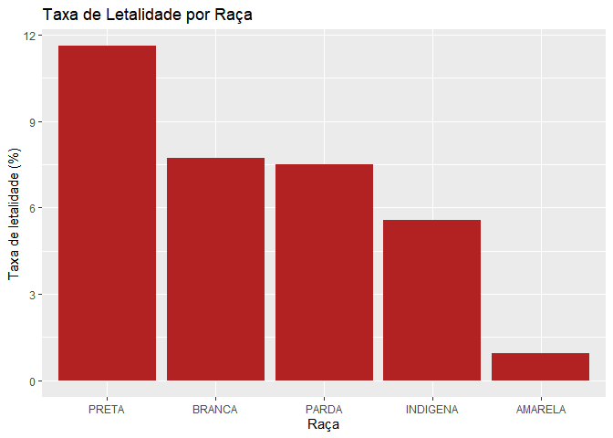<!-- -->

Confirmando a hipótese, a taxa de letalidade entre pessoas pretas é a
mais alta dentre as raças, com 11,6%. Brancos e pardos, com as maiores
quantidades de casos e óbitos, possuem taxa de letalidade de 7,8% e
7,4%. Em indígenas, a taxa de letalidade alcança 5,5%, e por último,
amarelos com menos de 1%.

Cabe ressaltar que a população preta, mesmo não possuindo os maiores
números de casos e óbitos absolutos, é a que tem maior probabilidade de
morrer por COVID-19. Considerando a população negra (pretos e pardos),
as chances de evolução da doença a óbito ficam em 8,04%. Portanto, os
resultados encontrados evidenciam a relação desigual entre óbitos e
casos confirmados considerando o fator raça.

<b> Conclusão</b>

Através das análises realizadas, foi possível perceber que, entre os
fatores de desigualdade apontados, a desigualdade racial é a que mais
apresentou reflexos com relação à letalidade da doença no Estado de
Minas Gerais. Embora tenha sido identificada uma correlação também entre
a letalidade e o IDH dos municípios, indicando que regiões mais pobres
apresentam maior índice de letalidade, a realidade, não só em Minas
Gerais mas no Brasil de forma geral, é que população preta e parda
frequentemente também é a população mais pobre. A análise desses dados
nos mostra, mais uma vez, uma condição já conhecida, a do racismo
estrutural brasileiro, que ao limitar o acesso da população preta e
parda a condições iguais de educação e trabalho também restringe essa
população a condições desiguais de renda e saúde. A doença não escolhe
suas vítimas pela cor, mas a sociedade sim.
